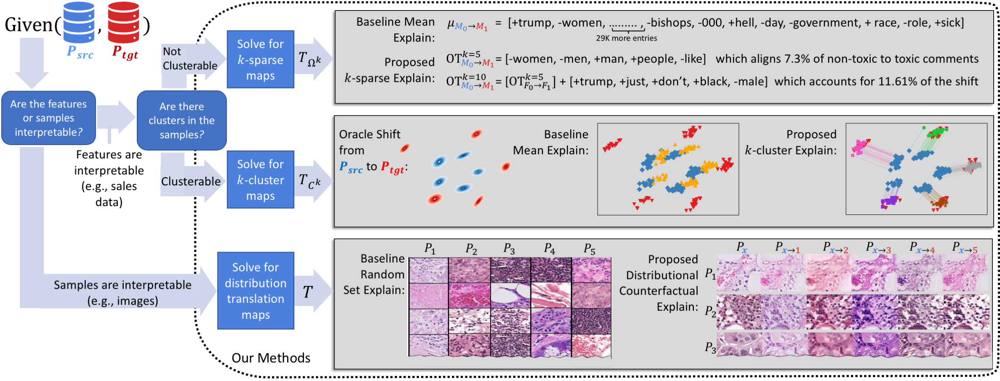

# Explaining Distribution Shifts Overview

Greeting :wave:! This is the repository for the IMCL Publication [Towards Explaining Distribution Shifts](https://arxiv.org/abs/2210.10275). 
In this work we answer the question: ''What is a distribution shift explanation?'' and introduce a novel framework for explaining distribution shifts via transportation maps between a source and target distribution which are either inherently interpretable or interpreted using post-hoc interpretability methods.


# Code for the ICML Publication: Towards Explaining Distribution Shifts

To recreate the results for the experiment, first create the corresponding environment (via conda by `conda env create -f environment.yml`).

Then unzip the `data.zip` file.

Within the `notebooks` folder, you can find all the corresponding jupyter notebooks to recreate the experiments. For example, to recreate the shift explanation results for the adult-income dataset, just run the `adult-income-experiment.ipynb` notebook (and for the baselines, run the `adult-income-experiment-baseline.ipynb`). 

If you have any troubles running these, feel free to reach out to the contacts listed [in our ICML paper](https://arxiv.org/abs/2210.10275) or via the contact [from the first-author's website](https://www.seankulinski.com/).

Cheers!


# Bibtex Citation
If you reference this work, please consider citing our publication:
```
@inproceedings{kulinski2023towards,
  title={Towards explaining distribution shifts},
  author={Kulinski, Sean and Inouye, David I},
  booktitle={International Conference on Machine Learning},
  pages={17931--17952},
  year={2023},
  organization={PMLR}
}
```